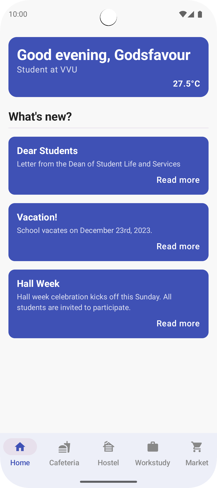
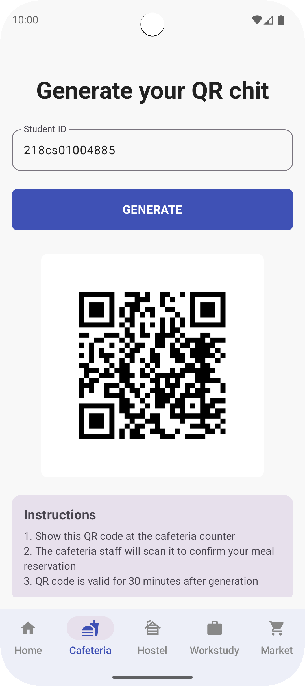
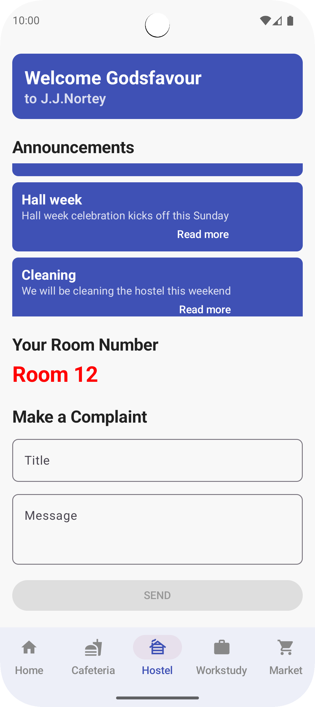
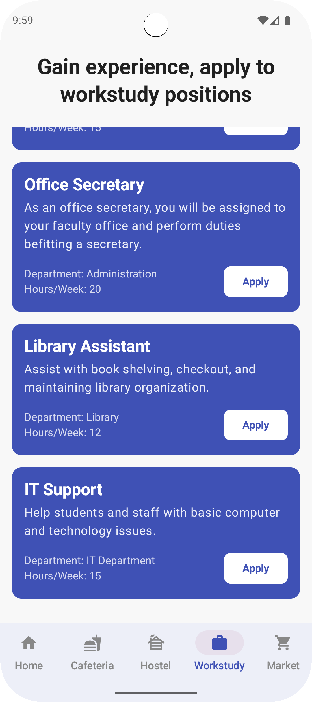
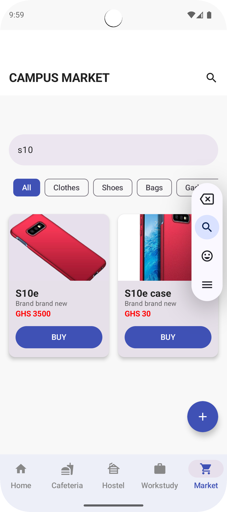
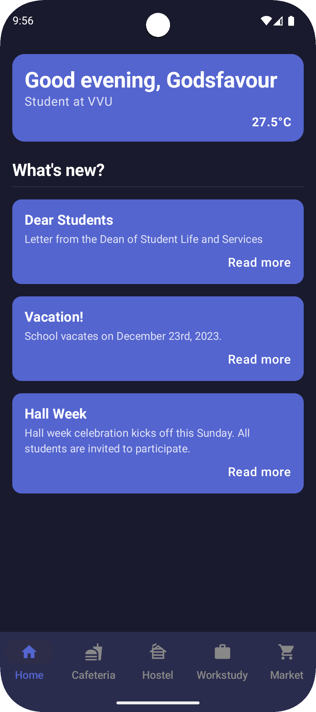
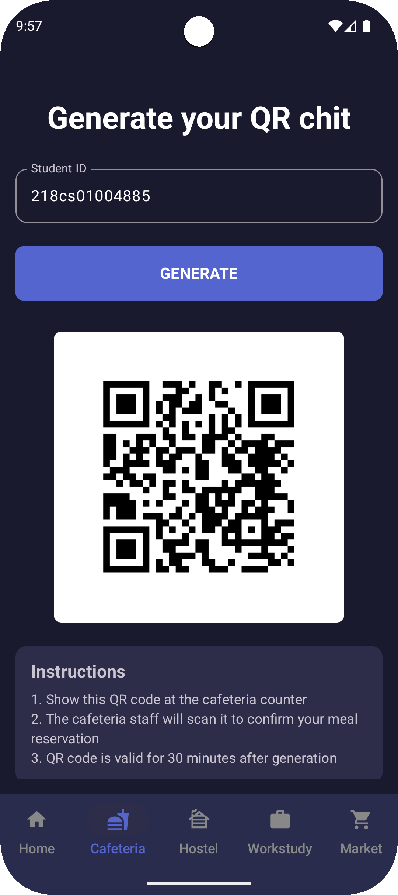
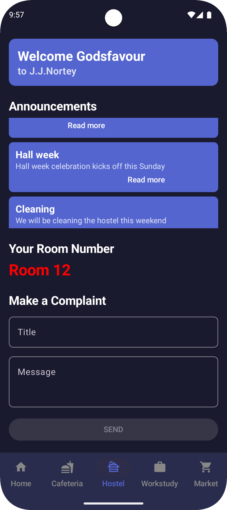
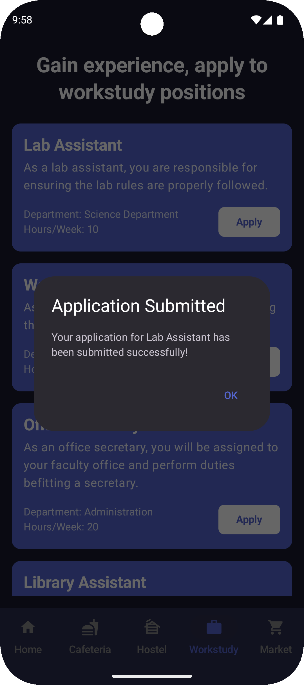
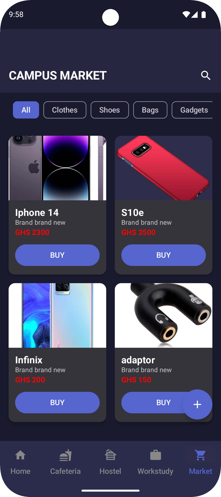

# VVUSA
VVUSA (Valley View University Studentlife App) is a Jetpack Compose application for Android. This revamped version of the original Java app aims to enhance the student experience at Valley View University by unifying various aspects of student life into a single, convenient platform with a modern UI.

Presented at VVU ICTExpo 2023, you can watch a preview of the original presentation [here](https://youtu.be/L6lbALwX2c0?si=0Mt4q96zEPnXtS1i).

## About
The Valley View Studentlife mobile application was originally developed by Kio Godsfavour, a product of VVU. The mobile application was developed as part of his final year project when he discovered existing problems he had encountered during his four-year tenure as a student at the University. This version has been completely redesigned using Jetpack Compose for a more modern and responsive user experience.

The VVUSA strives to make the studentlife experience at Valley View University exponentially better by tackling 4 very key aspects that students encounter during their stay on campus:
1. The four hostels
2. The Cafeteria
3. The Workstudy department
4. Buying and selling on campus

## Features
The app performs four primary functions:
1. **Room Booking:** Allows students to book rooms in the university hostels from the comfort of their homes.
2. **Digital Cafeteria Chits:** Generates digital chits for students to use at the cafeteria, reducing paper waste.
3. **Workstudy Applications:** Provides an automated system for applying to workstudy positions.
4. **Virtual Marketplace:** Creates a platform for students to buy and sell items on campus.

## Screenshots

### Light Theme

  
  
  
  
  

### Dark Theme

  
  
  
  
  

## Technology Stack
- **UI Framework**: Jetpack Compose
- **Architecture**: MVVM (Model-View-ViewModel)
- **Backend**: Firebase (Authentication, Firestore, Storage)
- **Language**: Kotlin

## Acknowledgments
Special thanks to the faculty and students of Valley View University for their support and feedback during the development of this app.
